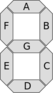

# Problem

Tom is a boy whose dream is to become a scientist, he invented a lot in his spare time. He came up with a great idea several days ago: to make a stopwatch by himself! So he bought a seven-segment display immediately.

The seven elements of the display are all light-emitting diodes (LEDs) and can be lit in different combinations to represent the arabic numerals like:

However, just when he finished the programs and tried to test the stopwatch, some of the LEDs turned out to be broken! Some of the segments can never be lit while others worked fine. So the display kept on producing some ambiguous states all the time...

Tom has recorded a continuous sequence of states which were produced by the display and is curious about whether it is possible to understand what this display was doing. He thinks the first step is to determine the state which the display will show next, could you help him?

Please note that the display works well despite those broken segments, which means that the display will keep on counting down cyclically starting from a certain number (can be any one of 0-9 since we don't know where this record starts from). 'Cyclically' here means that each time when the display reaches 0, it will keep on counting down starting from 9 again.

For convenience, we refer the seven segments of the display by the letters A to G as the picture below:

